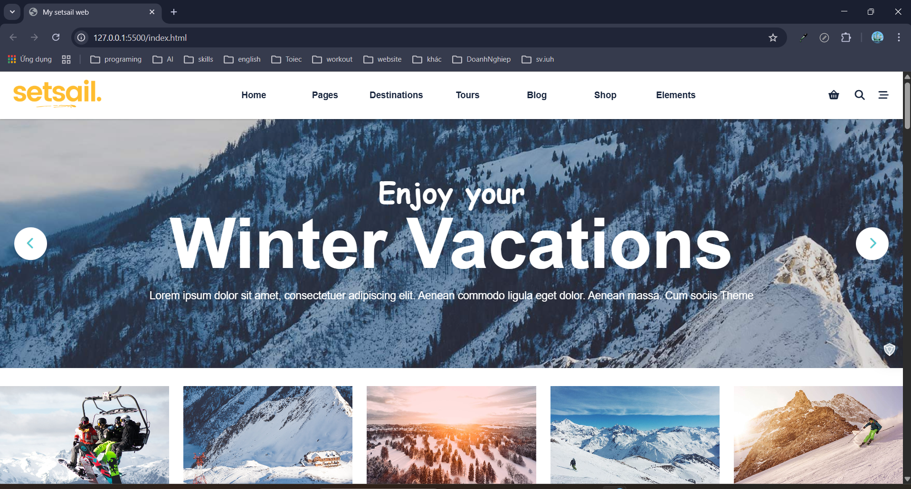
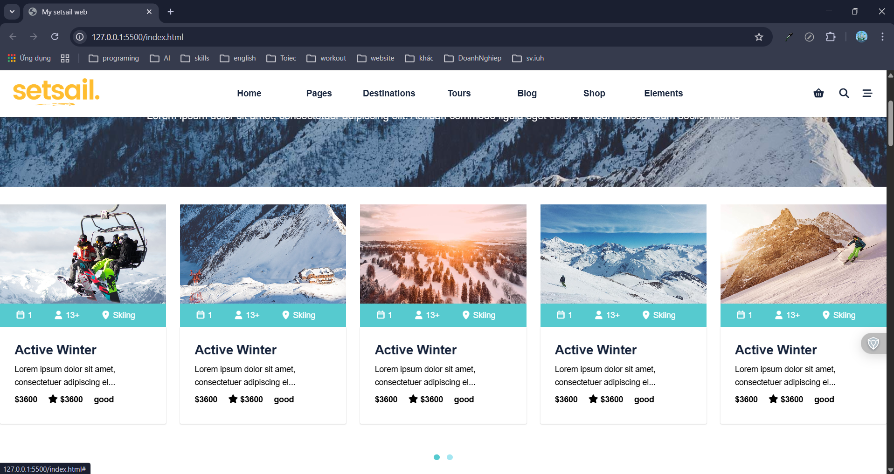
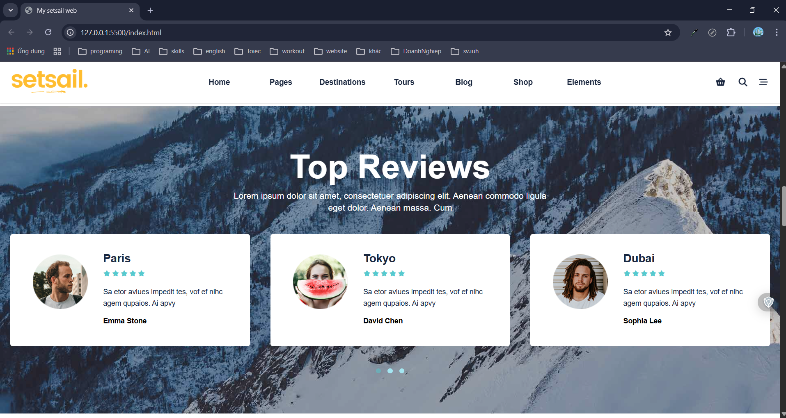
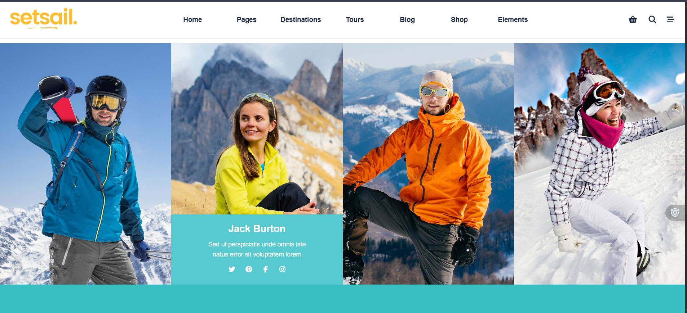
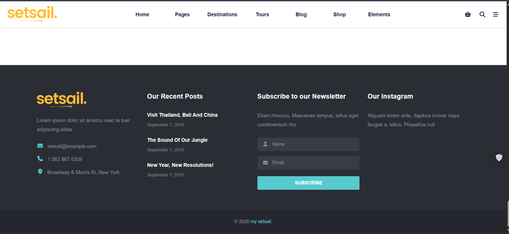

# Setsail Winter Holidays (UI Clone)

A personal frontend practice project focused on cloning the UI and interactions of a modern travel / holiday landing page using core web technologies.

## Overview
This project is a **static UI clone** inspired by the *Setsail – Winter Holidays* website.  
It was built as a **self-learning personal project** to practice HTML structure, CSS styling, animations, and basic JavaScript interactions.

Reference design:  
https://setsail.qodeinteractive.com/winter-holidays/

## Screenshots (Project Preview)

### Homepage

### Tour Section

### Review Section

### Holidays Section

### Team Section

### Footer

> All screenshots are taken from the implemented UI of this project, not from the original reference website.

## Technologies Used
- HTML5  
- CSS3  
- JavaScript (Vanilla)

## Key Features
- Static landing page layout
- Multiple UI sections similar to a real-world product website
- CSS animations and sliders
- Responsive layout for common screen sizes
- Focus on UI behavior and visual presentation (no backend)

## Scope & Purpose
- Personal project (100% individual work)
- Frontend UI practice only
- No backend, no database, no deployment
- Built for learning and portfolio / CV demonstration

## What I Practiced
- Writing semantic HTML structure
- Building layouts with CSS
- Creating animations and interactive elements
- Using vanilla JavaScript for UI behavior
- Organizing project structure for maintainability

## Notes for Recruiters
This project is created for **Frontend Intern applications** to demonstrate:
- Fundamental frontend skills
- Ability to clone and implement real-world UI designs
- Understanding of clean structure and maintainable code

